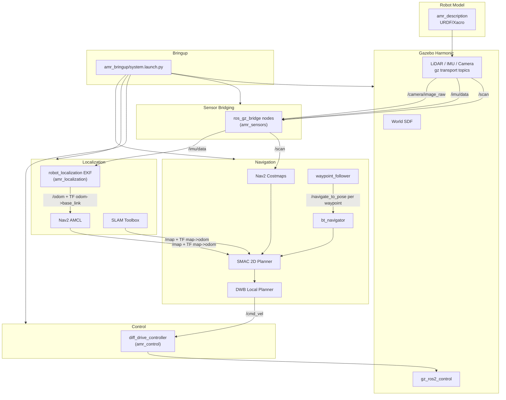

# AMR Base Stack — Architecture Overview

This document provides the system-level data flow for the `amr_ws` stack.

---

## Package Map

```
amr_ws/
  src/
    amr_description/       # URDF/Xacro, ros2_control, Gazebo sensor plugins
    amr_control/           # diff_drive_controller config, controller_manager launch (config-only)
    amr_sensors/           # ros_gz_bridge launch + sensor bridge config
    amr_simulation/        # Gazebo Harmonic world, ros_gz_sim spawn, bridge remappings
    amr_localization/      # EKF, SLAM Toolbox, AMCL launch/config
    amr_navigation/        # Nav2 params, costmaps, planners, BT, waypoints, maps
    amr_bringup/           # Top-level system.launch.py orchestrator
    amr_metrics/           # Validation tours, campaigns, map scoring, plots
  docs/                    # Architecture docs
  docker/                  # Dockerfile, docker-compose
  .devcontainer/           # VS Code Dev Container
```

---

## System Diagram



---

## Data Flow Summary

| Signal | Source | Sink |
|---|---|---|
| `/cmd_vel` | Nav2 DWB controller | `diff_drive_controller` |
| `/scan` | Gazebo LiDAR via `ros_gz_bridge` | Nav2 costmap, SLAM Toolbox |
| `/imu/data` | Gazebo IMU via `ros_gz_bridge` | EKF |
| `/camera/image_raw` | Gazebo RGB camera via `ros_gz_bridge` | `image_proc` |
| `/odom` | EKF (wheel odom + IMU fused) | Nav2, AMCL |
| `/map` | SLAM Toolbox or `map_server` | Nav2 global costmap |
| `/tf` map→odom→base_link | SLAM Toolbox or AMCL + EKF | All consumers |
| `/tf` base_link→sensors | `robot_state_publisher` | All consumers |

---

## Process Layout

The nav2 servers can run either way, chosen at launch with `use_composition`:

| | `use_composition:=false` | `use_composition:=true` |
|---|---|---|
| Processes | one per server (7) | one `component_container_isolated` |
| DDS participants for nav2 | 7 | 1 |
| Lifecycle manager start | delayed by `lifecycle_settle` after the last node's process starts | loaded last, so ordering replaces the delay |

The delay on the process-per-node path is not cosmetic. A lifecycle manager
that creates its service clients during a 40-node launch storm can block
forever waiting on discovery, which used to abort bring-up entirely. Loading
the servers and their manager into one container removes that race rather than
timing around it, because the manager is constructed after the nodes it
manages and they share a single participant.

The container is `component_container_isolated`, which gives each component
its own executor on its own thread. A shared single-threaded executor
deadlocks: the lifecycle manager calls `change_state` on servers that would be
waiting in the same executor for that call to return.

### Which one is the default, and why

**Process-per-node remains the default.** Composition is validated, not
preferred, and the measurements are the reason:

| | process-per-node | composed |
|---|---|---|
| tour result (3 runs each, same commit) | 10/12 goals | 12/12 goals |
| bring-up to `active` | 15 / 18 / 15 / 22 s | 14 / 15 / 15 / 23 s |
| nav2 processes | 8 | 1 |

Composition shows no regression, and at N=3 that is all it shows — 12/12
against 10/12 is well inside the run-to-run spread this world produces. What
it does *not* show is any benefit worth changing a default for: bring-up is
unchanged, because the discovery race composition would remove was already
removed by event-sequenced start-up, and nav2's components do not enable
intra-process transport here, so there is no data-path win either.

Against that, process-per-node keeps failure isolation and per-node logs,
which matter in a stack whose main activity is diagnosis. Flipping a default
on a change with a measured benefit of zero is the move this project has
repeatedly been burned by, so the default stays and the option is documented.

`robot_localization`'s EKF is not a composable component in this release and
stays a separate process either way, as do the Python shims
(`twist_to_stamped`, `tf_restamp`).

---

## Reproducibility

- **Docker:** `docker compose -f docker/docker-compose.yml up sim`
- **Dev Container:** Open in VS Code → "Reopen in Container"
- **Native:** Source ROS 2 Jazzy, `colcon build`, `source install/setup.bash`
- **rosdep:** `rosdep install --from-paths src --ignore-src -r -y`
