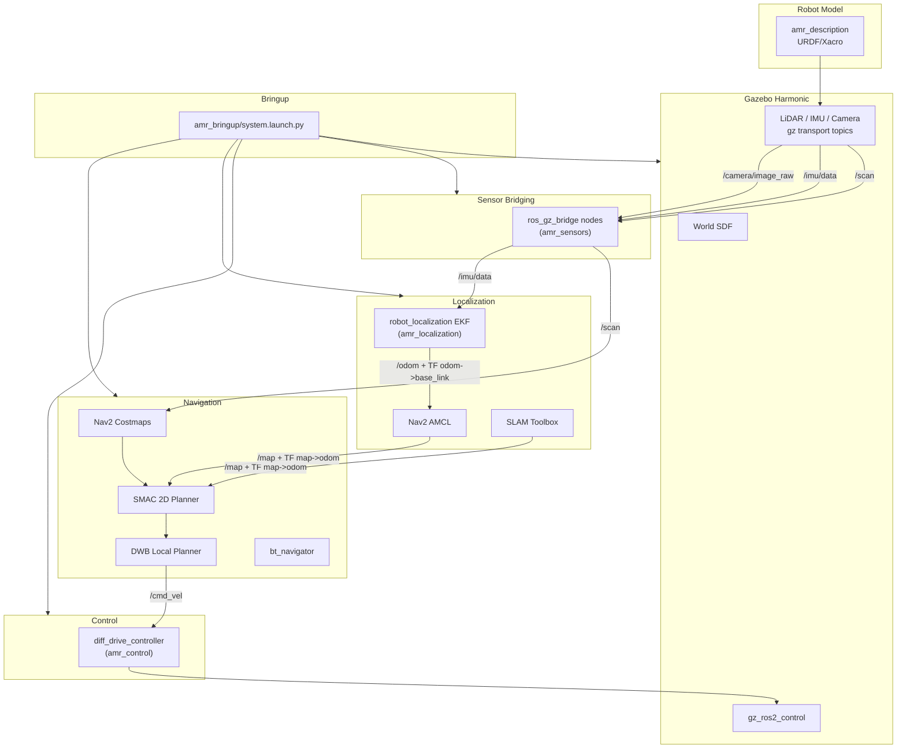

# AMR Base Stack — Architecture Overview

This document provides the system-level data flow for the `amr_ws` stack.

---

## Package Map

```
amr_ws/
  src/
    amr_description/       # URDF/Xacro, ros2_control, Gazebo sensor plugins
    amr_control/           # diff_drive_controller config, controller_manager, C++ nodes
    amr_sensors/           # ros_gz_bridge launch + sensor bridge config
    amr_simulation/        # Gazebo Harmonic world, ros_gz_sim spawn, bridge remappings
    amr_localization/      # EKF, SLAM Toolbox, AMCL launch/config
    amr_navigation/        # Nav2 params, costmaps, planners, BT, maps
    amr_bringup/           # Top-level system.launch.py orchestrator
  docs/                    # Architecture docs
  docker/                  # Dockerfile, docker-compose
  .devcontainer/           # VS Code Dev Container
```

---

## System Diagram



---

## Data Flow Summary

| Signal | Source | Sink |
|---|---|---|
| `/cmd_vel` | Nav2 DWB controller | `diff_drive_controller` |
| `/scan` | Gazebo LiDAR via `ros_gz_bridge` | Nav2 costmap, SLAM Toolbox |
| `/imu/data` | Gazebo IMU via `ros_gz_bridge` | EKF |
| `/camera/image_raw` | Gazebo RGB camera via `ros_gz_bridge` | `image_proc` |
| `/odom` | EKF (wheel odom + IMU fused) | Nav2, AMCL |
| `/map` | SLAM Toolbox or `map_server` | Nav2 global costmap |
| `/tf` map→odom→base_link | SLAM Toolbox or AMCL + EKF | All consumers |
| `/tf` base_link→sensors | `robot_state_publisher` | All consumers |

---

## Reproducibility

- **Docker:** `docker compose -f docker/docker-compose.yml up sim`
- **Dev Container:** Open in VS Code → "Reopen in Container"
- **Native:** Source ROS 2 Jazzy, `colcon build`, `source install/setup.bash`
- **rosdep:** `rosdep install --from-paths src --ignore-src -r -y`
